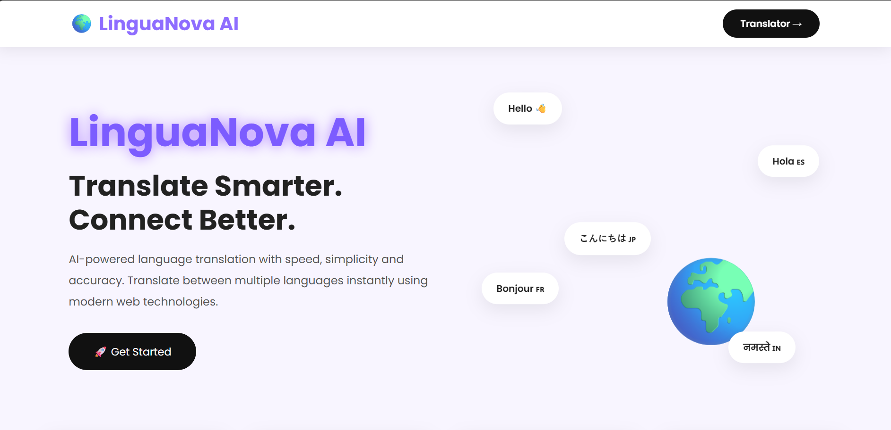
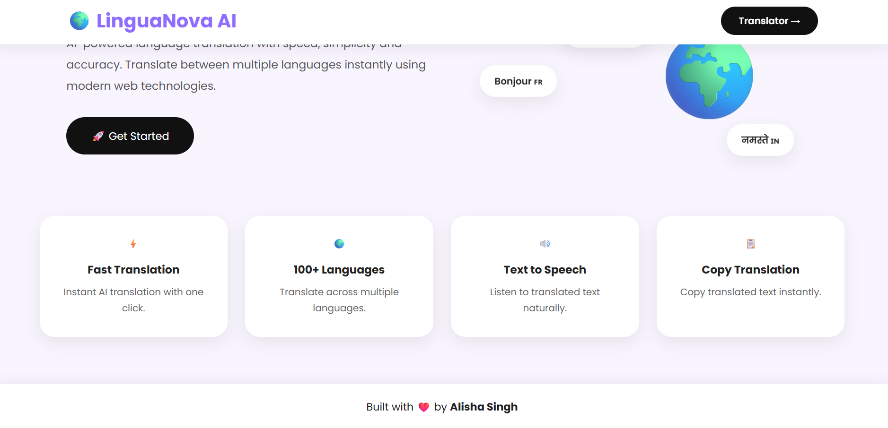
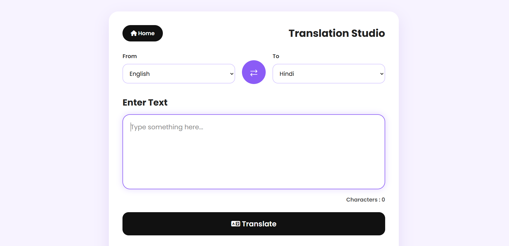
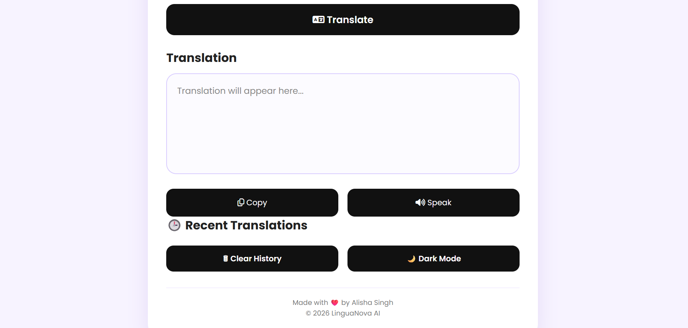
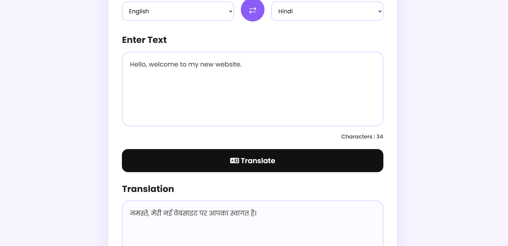
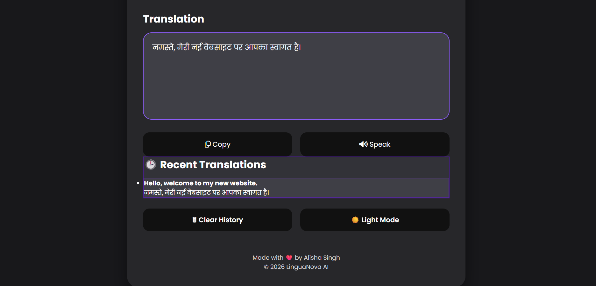

#🌍 LinguaNova AI

An AI-powered multilingual language translator built using HTML, CSS, and JavaScript.

##🚀 Live Demo

🔗 https://alishasingh24.github.io/LinguaNova-AI/

##✨ Features

- 🌐 Translate text into multiple languages
- 🔄 Language swap
- 📋 Copy translated text
- 🔊 Text-to-Speech
- 🌙 Dark Mode
- 🕒 Translation History
- 📱 Fully Responsive Design
- 🎨 Modern Lavender UI

##🛠️ Tech Stack

- HTML5
- CSS3
- JavaScript (ES6)
- MyMemory Translation API
- GitHub Pages

##📂 Project Structure

LinguaNova-AI/
│
├── index.html
├── translator.html
├── style.css
├── landing.css
├── script.js
├── images/
└── README.md

##📸 Screenshots
###🏠 Landing Page

###🌍 Landing Page (Overview)

###✍️ Translator Page

###📱 Translator Page (Bottom Section)

###🔄 Translation Demo

###🌙 Dark Mode

##💡 Future Improvements

- Voice Input
- AI Translation Suggestions
- Favorite Translations
- Download Translation
- More Languages
- Integrate Google Cloud Translation API for more accurate AI-powered translations.
  
##👩‍💻 Author

**Alisha Singh**

B.Tech CSE Student

GitHub:
https://github.com/alishasingh24

Linkedin:
linkedin.com/in/alishasingh024

⭐ If you like this project, don't forget to star the repository!
